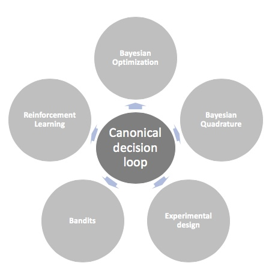

<h4>Emukit: the first open source toolkit for emulation and decision making under uncertainty</h4>

We are launching Emukit, a highly adaptable Python toolkit for enriching decision making under uncertainty. 

       

      

       
